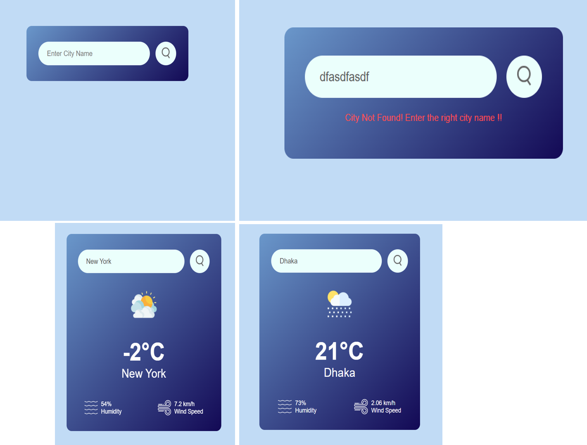

# 🌤️ Weather App

A simple and responsive **Weather Application** built using **HTML, CSS, and JavaScript**.  
It fetches real-time weather data using the **OpenWeatherMap API**.

---

## 🚀 Features
- Search weather by city name
- Displays temperature, humidity, and wind speed
- Dynamic weather icons based on conditions
- Error handling for invalid city names
- Keyboard support (Press Enter to search)

---

## 🛠️ Technologies Used
- HTML5
- CSS3
- JavaScript (ES6)
- OpenWeatherMap API

---

## 📸 Screenshot


---

## 🔑 API Configuration
This project uses the **OpenWeatherMap API**.

> ⚠️ For security reasons, the API key is not included.  
> Please add your own API key from:  
> https://openweathermap.org/api

---

## ▶️ How to Run Locally
1. Clone the repository
   ```bash
   git clone https://github.com/your-username/30-days-30-projects-js.git
