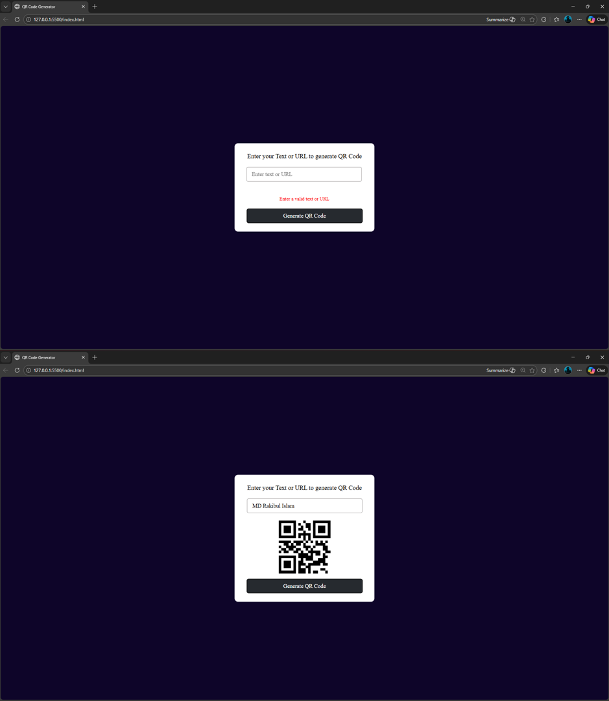

# 🔳 QR Code Generator

A simple **QR Code Generator** built using **HTML, CSS, and JavaScript**.  
Users can generate QR codes for any text or URL instantly.

---

## 🚀 Features
- Generate QR code from text or URL
- Uses online QR Code API
- Input validation with error message
- Clean and responsive UI

---

## 🛠️ Technologies Used
- HTML5
- CSS3
- JavaScript (Vanilla)
- QRServer API

---

## 📸 Screenshot

---

## ▶️ How to Use
1. Enter any text or URL
2. Click **Generate QR Code**
3. QR code appears instantly

---

## 🌐 API Used
https://goqr.me/api/

---

## 📅 Challenge
This project is part of my **30 Days – 30 Projects (HTML, CSS & JavaScript)** challenge.

---

## 👨‍💻 Author
**MD Rakibul Islam**  
Full Stack Developer | CSE Graduate  
🔗 GitHub: https://github.com/Rakib-ul
