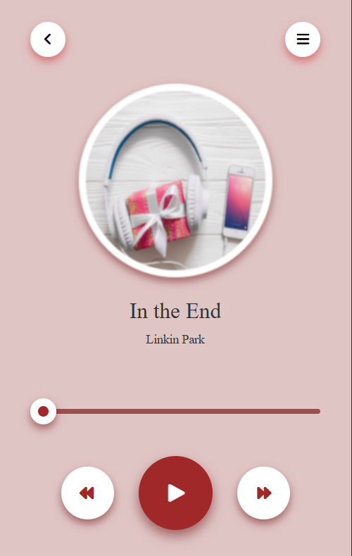

# 🎵 Music Player App

A modern and responsive **Music Player Application** built using **HTML, CSS, and Vanilla JavaScript**.  
This app allows users to play, pause, and control audio with a custom progress bar.

---

## 🚀 Features

- Play / Pause functionality
- Dynamic progress bar
- Seek audio by dragging slider
- Interactive UI with Font Awesome icons
- Responsive and clean design

---

## 🛠️ Technologies Used

- HTML5
- CSS3
- JavaScript (ES6)
- HTML Audio API
- Font Awesome Icons

---

## 🎮 How It Works

- The audio element is controlled using JavaScript.
- `play()` and `pause()` methods manage playback.
- The progress bar updates dynamically based on `currentTime`.
- Users can drag the slider to seek a specific time in the song.

---

## 📸 Screenshot



---


---

## ▶️ How to Run

1. Clone the repository:

   ```bash
   git clone https://github.com/your-username/30-days-30-projects-js.git

2. Open Day-03-Music-Player

3. Open index.html in your browser

---

## 📅 Challenge

This project is part of my:

🚀 30 Days – 30 Projects (HTML, CSS & JavaScript) Challenge

---

## 📅 Challenge

1. DOM Manipulation

2. Event Handling

3. Audio API Usage

4. Dynamic UI Updates

5. JavaScript Logic Control

---

## 👨‍💻 Author

MD Rakibul Islam
Full Stack Developer | CSE Graduate